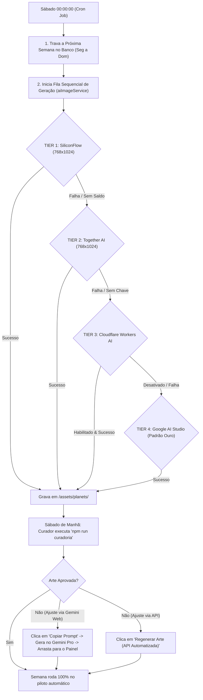

# 🛰️ ARQUITETURA DO PIPELINE DE IA & AUTOMAÇÃO SEMANAL (CASCADE FALLBACK CHAIN)

> **Documento Oficial de Engenharia de Software e Segurança**  
> **Projeto:** Exoplanetas Extremos (Daily Exoplanets)  
> **Website Oficial em Produção:** **[https://exoplanets.luckhaosbb.dev](https://exoplanets.luckhaosbb.dev/)**  
> **Autor/Curador:** Lucas Gomes (github.com/luckhaosbb)  
> **Padrão Arquitetural:** Circuit Breaker / Cascade Fallback Chain (Alta Disponibilidade)

---

## 1. Visão Geral da Arquitetura

O sistema opera em **Ciclos Cósmicos Semanais Fechados** (Segunda-feira a Domingo). O objetivo é garantir **automação autônoma total**: o servidor trabalha sozinho de madrugada e o autor/curador apenas audita os resultados pelo Painel de Curadoria no sábado pela manhã.



---

## 2. A Cascata de Resiliência Consolidada (4 Camadas de Alta Disponibilidade)

O motor [`server/services/aiImageService.js`](file:///C:/Users/Lucas/Downloads/Daily%20Exoplanets/server/services/aiImageService.js) opera com arquitetura multi-rota de alta fidelidade:

| Rota | Provedor / Motor | Modelo | Status Atual | Diagnóstico / Observações |
| :---: | :---: | :---: | :---: | :---: |
| **Rota 1** | **SiliconFlow** | `FLUX.1-schnell` | 🟡 Chave requer renovação | Resolução nativa vertical `768x1024`. A chave retornou 402 (saldo $0.00). Requer saldo ativo. |
| **Rota 2** | **Together AI** | `FLUX.1-schnell` | 🟢 **$5.00 Dólares Gratuitos** | Resolução nativa vertical `768x1024` e horizontal `1024x768`. Provedor oficial de GPU de alta velocidade com bônus inicial no cadastro. |
| **Rota 3** | **Cloudflare Workers AI** | `FLUX.1-schnell` | ⚪ **Desativada pelo Curador** | Código preservado (`CLOUDFLARE_ENABLED=false`). Credenciais válidas, mas mantida desligada por gerar apenas 1:1 e estilo simplificado. |
| **Rota 4** | **Google Cloud / AI Studio** | `Imagen 3 / Gemini Image` | 🟢 **Padrão Ouro da Coleção** | O motor de referência que produziu a qualidade impecável dos pôsteres #001 a #005 (proporção A4 vertical e horizontal nativa, nanquim e tipografia 3D). |

> **Nota de Decomissionamento de Rotas Antigas:**  
> * **Hugging Face (`HF_TOKEN`):** Removida totalmente do código e das variáveis de ambiente após a Hugging Face descontinuar a infraestrutura de inferência serverless gratuita de imagens (HTTP 410).  
> * **Pollinations.ai:** Removida totalmente a pedido do curador por gerar composições cósmicas abstratas com marca d'água e incompatíveis com a estética pulp Jack Kirby de 1970.

---

## 3. Rotina Semanal do Curador (Fluxo Híbrido: Automação + Gemini Pro Web)

Com as melhorias no Observatório, você possui **duas formas complementares de operar**:

### Modo A: 100% Piloto Automático (Todo Sábado)
1. O cron job do servidor aciona a cascata aos sábados à meia-noite e gera todas as 7 artes.
2. Você roda `npm run curadoria` no sábado pela manhã apenas para auditar.

### Modo B: Curadoria com sua Assinatura Google AI Pro / Gemini Web (Custo Zero)
1. Abra o painel com `npm run curadoria`.
2. Clique no planeta desejado na grade dos 7 dias.
3. Clique no botão **"📋 Copiar Prompt Mestre (Gemini Pro)"**. O prompt oficial daquele exoplaneta é copiado para sua área de transferência.
4. Abra o [Gemini Advanced Web](https://gemini.google.com/) com seu plano de estudante, cole o prompt e envie.
5. Quando o Gemini gerar a arte no estilo Jack Kirby, baixe a imagem e **arraste o arquivo diretamente para o quadro do pôster** no painel (ou clique em **"📤 Enviar Arte do Gemini"**).
6. O sistema grava o arquivo instantaneamente em `/server/assets/planets/` e `/public/assets/planets/`, renderiza os selos oficiais da NASA e marca a Issue como pronta!

---

## 4. Matriz de Prompts Especializados por Provedor de IA (Arquitetura Multi-Rota)

Cada provedor possui características distintas de proporção de tela (*aspect ratio*) e interpretação de tokens (*text encoder*). Para evitar que ajustes em um modelo degradem o outro, o arquivo [`server/data/prompts.js`](file:///C:/Users/Lucas/Downloads/Daily%20Exoplanets/server/data/prompts.js) implementa **construtores de prompt especializados e isolados para cada rota**:

### 🎯 4.1. Rota Gemini 3.1 Flash / Google Imagen (Padrão Mestre das Issues #001 a #005)
* **Proporção Nativa:** `2:3` (Vertical) e `3:2` (Horizontal).
* **Características:** Prosa cinematográfica rica em inglês, Jack Kirby cosmic energy krackle, CMYK halftone dots, 100% Full-bleed sangria total, tipografia 3D extrusada integrada ao topo.
* **Status:** **Intocado e preservado** para garantir consistência estética absoluta com as obras-primas já homologadas.

### ⚡ 4.2. Rota Cloudflare Workers AI (`FLUX.1-schnell`)
* **Proporção Nativa:** `1:1` fixo (`1024x1024`).
* **Diagnóstico de Engenharia:** Ao enquadrar uma imagem quadrada (1:1) dentro de um pôster vertical A4 (2:3), o canvas faz um zoom de compensação (*cover*), descartando 300px nas laterais esquerda e direita. Se o letreiramento for largo, o texto é cortado.
* **Estratégia de Prompt (Safe Zone Central 50%):**
  * O prompt da Cloudflare instrui explicitamente a IA a concentrar a tipografia e o planeta na **coluna central de 50% de largura**, deixando as margens laterais repletas de espaço estrelado vazio para sangria de corte.
  * Letreiramento compacto, alto e estreito (*condensed title lettering*).

### 🇨🇳 4.3. Rota SiliconFlow (`FLUX.1-schnell`)
* **Proporção Nativa:** `768x1024` (Vertical) e `1024x768` (Horizontal).
* **Características:** Aproveita a resolução nativa da API sem necessidade de cortes no canvas.
* **Formato:** Otimizado para o encoder T5-XXL do FLUX com descrições objetivas de física e iluminação cósmica.

---

## 5. Práticas de Segurança e Hardening (OWASP / Sênior)

1. **Proteção contra Path Traversal (CWE-22):**
   * Todo identificador `planetId` que interage com o sistema de arquivos é rigidamente validado pela expressão regular: `/^[a-zA-Z0-9_-]{2,64}$/`. Tentativas de injeção de caminho (`../`) são descartadas com erro HTTP 400.
2. **Proteção contra Vazamento de Credenciais (CWE-200):**
   * Tokens como `SILICONFLOW_API_KEY`, `CLOUDFLARE_API_TOKEN`, `HF_TOKEN`, `GOOGLE_GENAI_API_KEY` e `SERVER_SECRET_KEY` residem exclusivamente no servidor (`server/config/index.js`) e nunca são enviados para o front-end.
3. **Autenticação Criptográfica HMAC-SHA256:**
   * O endpoint `/api/curadoria` e todas as rotas administrativas exigem token assinado com validade de 24 horas (`requireCuratorAuth`).
4. **Resiliência do Banco de Dados:**
   * O sistema opera com **Arquitetura Híbrida**: se o PostgreSQL estiver ativo (`DATABASE_URL`), ele persiste com transações SQL seguras; se o PostgreSQL estiver indisponível ou em desenvolvimento local, o sistema ativa automaticamente o fallback persistente em JSON sem quebrar a aplicação.
5. **Timeouts e Circuit Breaker:**
   * Chamadas externas a provedores de IA possuem retry limitado e fallback instantâneo em caso de erro, prevenindo bloqueio do event-loop do Node.js.

---

## 6. Como Ativar o Cloudflare Workers AI Gratuito (Passo a Passo)

A Cloudflare oferece **10.000 Neurons gratuitos por dia** para todos os usuários cadastrados (sem necessidade de plano pago):

1. **Criar Conta Gratuita:** Acesse [dash.cloudflare.com/sign-up](https://dash.cloudflare.com/sign-up).
2. **Copiar Account ID:** Na barra lateral ou URL do painel, copie o seu `Account ID` (string alfanumérica de 32 caracteres).
3. **Criar API Token:**
   * Vá em **My Profile** > **API Tokens** > **Create Token**.
   * Use o template **"Workers AI"** ou crie um Custom Token com permissão: `Account > Workers AI > Read & Edit`.
   * Copie o token gerado.
4. **Salvar no `.env`:**
   ```env
   CLOUDFLARE_ACCOUNT_ID=seu_account_id_aqui
   CLOUDFLARE_API_TOKEN=seu_token_aqui
   ```
O backend detectará automaticamente as chaves e priorizará o Cloudflare Workers AI na Rota 2.

---

## 7. Runbook Operacional de Verificação e Testes

Para validar a integridade de todo o pipeline sem esperar a meia-noite de sábado, o desenvolvedor dispõe dos seguintes comandos:

| Ação | Comando / Procedimento |
| :--- | :--- |
| **Auditoria Semanal** | `npm run curadoria` (Abre navegador com token seguro) |
| **Disparo Manual do Ciclo** | Clicar em *"⚡ Executar Ciclo da Próxima Semana"* na tela de curadoria |
| **Regeneração Individual** | Clicar em *"🔄 Regenerar Arte"* no card do planeta selecionado |
| **Teste de Build Frontend** | `npm run build` (Valida empacotamento estático do Vite) |
| **Ambiente de Produção (Online)** | [https://exoplanets.luckhaosbb.dev](https://exoplanets.luckhaosbb.dev/) |
| **Healthcheck da API (Produção)** | `curl https://exoplanets.luckhaosbb.dev/api/health` |
| **Verificação de Healthcheck (Local)** | `curl http://localhost:3001/api/planet-of-the-day` |

