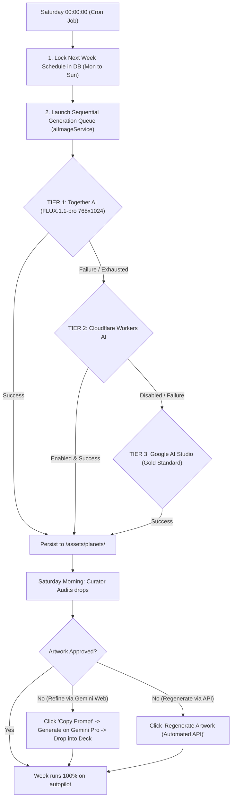

# 🛰️ AI PIPELINE ARCHITECTURE & WEEKLY AUTOMATION (CASCADE FALLBACK CHAIN)

> **Official Software Engineering & Security Document**  
> **Project:** Extreme Exoplanets (Daily Exoplanets)  
> **Official Live Website:** **[https://exoplanets.luckhaosbb.dev](https://exoplanets.luckhaosbb.dev/)**  
> **Author/Curator:** Lucas Gomes (github.com/luckhaosbb)  
> **Architectural Pattern:** Circuit Breaker / Cascade Fallback Chain (High Availability)

---

## 1. Architectural Overview

The system operates in **Closed Weekly Cosmic Cycles** (Monday through Sunday). The core objective is **full autonomous automation**: the server operates unattended overnight, while the author/curator audits generation results through the Curator Deck on Saturday morning.



---

## 2. Consolidated Resilience Cascade (High Availability Layers)

The generation engine in [`server/services/aiImageService.js`](server/services/aiImageService.js) implements a high-fidelity multi-tier cascade architecture:

| Tier | Provider / Engine | Model | Current Status | Diagnostics / Notes |
| :---: | :---: | :---: | :---: | :---: |
| **Route 1 (Primary)** | **Together AI** | `black-forest-labs/FLUX.1.1-pro` | 🟢 **Active Primary Route** | Native vertical `768x1024` and horizontal `1024x768`. Ultra-fast GPU cluster with high-fidelity output. Initial $5.00 credit on onboarding. |
| **Route 2 (Fallback)** | **Cloudflare Workers AI** | `@cf/black-forest-labs/flux-1-schnell` | ⚪ **Configurable Standby** | Global Edge network with 10,000 free Neurons/day (`CLOUDFLARE_ENABLED=true`). Generates 1:1 canvas with safe-zone cropping. |
| **Manual / Gold Standard** | **Google Cloud / AI Studio** | `imagen-3.0-generate-002` / `Gemini Pro` | 🟢 **Master Collection Standard** | Benchmark engine responsible for the museum-grade quality of Issues #001 to #005 (native A4 2:3/3:2 aspect ratios, dynamic ink linework, and 3D typography). |

### Decommissioned & Legacy Routes:
- **SiliconFlow (`SILICONFLOW_API_KEY`):** Deprecated and demoted from the active cascade. SiliconCloud requires an active paid recharge (unfunded accounts return HTTP 402 with $0.00 balance).
- **Hugging Face (`HF_TOKEN`):** Completely removed from source code and environment variables following Hugging Face's discontinuation of serverless free image inference (HTTP 410 Gone).
- **Pollinations.ai:** Removed due to abstract generation artifacts, watermarking, and stylistic divergence from the 1970s Jack Kirby retro pulp aesthetic.

---

## 3. Curator Weekly Routine (Hybrid Workflow: Autopilot + Gemini Pro Web)

The platform provides **two complementary operating modes**:

### Mode A: 100% Autopilot (Every Saturday Midnight)
1. The backend cron scheduler activates the cascade on Saturday at 00:00:00 BRT and synthesizes all 7 artworks autonomously.
2. The curator inspects and audits the queue on Saturday morning.

### Mode B: Zero-Cost Curation with Google AI Pro / Gemini Advanced Web
1. Open the confidential Curator Deck.
2. Select any exoplanet in the 7-day schedule grid.
3. Click **"Copy Master Prompt (Gemini Pro)"** to copy the validated prompt to your clipboard.
4. Open [Gemini Advanced Web](https://gemini.google.com/), paste the prompt, and execute generation.
5. Download the resulting Jack Kirby style artwork and drag the file directly onto the poster viewport in the curation module.
6. The server immediately stores the master file into `/server/assets/planets/` and `/public/assets/planets/`, renders official NASA badges, and marks the Issue as ready.

---

## 4. Specialized Prompt Matrix by AI Provider (Multi-Route Architecture)

Each provider exhibits distinct aspect-ratio requirements and text-encoder idiosyncrasies. To prevent alterations on one model from degrading another, [`server/data/prompts.js`](server/data/prompts.js) implements **dedicated, isolated prompt builders per engine**:

### 🎯 4.1. Google Imagen 3 / Gemini (Issues #001 through #005 Gold Standard)
- **Native Aspect Ratio:** `2:3` (Vertical) and `3:2` (Horizontal).
- **Key Characteristics:** Rich cinematic English prose, Jack Kirby cosmic energy krackle dots, CMYK four-color halftone screens, 100% Full-bleed borderless composition, integrated extruded 3D typography.
- **Status:** Pristine and locked to maintain aesthetic uniformity with catalog masterpieces.

### ⚡ 4.2. Together AI (`FLUX.1.1-pro` / `FLUX.1-schnell`)
- **Native Resolutions:** `768x1024` (Vertical) and `1024x768` (Horizontal).
- **Key Characteristics:** Native vertical canvas without post-generation cropping. Optimized for Flux's T5-XXL text encoder with precise lighting, color palettes, and celestial physics descriptors.

### 🌐 4.3. Cloudflare Workers AI (`FLUX.1-schnell`)
- **Native Resolution:** Fixed `1:1` (`1024x1024`).
- **Engineering Accommodation:** Fitting a square (1:1) image into an A4 vertical canvas requires dynamic zoom/crop, removing 300px from left and right margins.
- **50% Central Safe Zone Strategy:** The Cloudflare prompt explicitly forces typography and planetary bodies into the central 50% width column, keeping outer margins as bleed-safe starry void.

---

## 5. Security & Hardening Best Practices (OWASP / Enterprise Grade)

1. **Path Traversal Defense (CWE-22):**
   - Every `planetId` interacting with the filesystem is strictly validated against: `/^[a-zA-Z0-9_-]{2,64}$/`. Path manipulation attempts (`../`) are immediately rejected with HTTP 400.
2. **Credential Leakage Prevention (CWE-200):**
   - API keys (`TOGETHER_API_KEY`, `CLOUDFLARE_API_TOKEN`, `GOOGLE_GENAI_API_KEY`, `SERVER_SECRET_KEY`) reside exclusively server-side in `server/config/index.js` and are never serialized to the frontend client.
3. **HMAC-SHA256 Cryptographic Authentication:**
   - Administrative and curation endpoints require signed session tokens validated via `requireCuratorAuth`.
4. **Database Resilience & Zero-Config Fallback:**
   - Hybrid persistence: Cloud PostgreSQL transactions when `DATABASE_URL` is set; seamless fallback to transactional JSON storage for local offline development.
5. **Circuit Breakers & Timeouts:**
   - External provider requests enforce short timeouts and bounded retry limits to prevent Node.js event-loop exhaustion.

---

## 6. How to Enable Cloudflare Workers AI (Optional Standby)

Cloudflare provides **10,000 free Neurons per day** on free-tier accounts:

1. **Create Free Account:** Sign up at [dash.cloudflare.com/sign-up](https://dash.cloudflare.com/sign-up).
2. **Retrieve Account ID:** Copy your 32-character hexadecimal `Account ID` from the dashboard URL or sidebar.
3. **Generate API Token:**
   - Navigate to **My Profile** > **API Tokens** > **Create Token**.
   - Use the **Workers AI** template or create a custom token with permission: `Account > Workers AI > Read & Edit`.
4. **Set Environment Variables:**
   ```env
   CLOUDFLARE_ENABLED=true
   CLOUDFLARE_ACCOUNT_ID=your_account_id_here
   CLOUDFLARE_API_TOKEN=your_token_here
   ```

---

## 7. Operational Verification Runbook

To test pipeline integrity without waiting for the scheduled Saturday midnight cron execution:

| Action | Command / Procedure |
| :--- | :--- |
| **Weekly Queue Audit** | Open Curator Deck via secure launcher |
| **Manual Batch Cycle** | Trigger *"⚡ Execute Next Week Cycle"* in the curator interface |
| **Individual Regeneration** | Trigger *"🔄 Regenerate Artwork"* on any selected planet card |
| **Frontend Production Build** | `npm run build` (Validates Vite static bundling) |
| **Live Observatory Web** | [https://exoplanets.luckhaosbb.dev](https://exoplanets.luckhaosbb.dev/) |
| **Production API Health Check** | `curl https://exoplanets.luckhaosbb.dev/api/health` |
| **Local API Health Check** | `curl http://localhost:3001/api/planet-of-the-day` |
